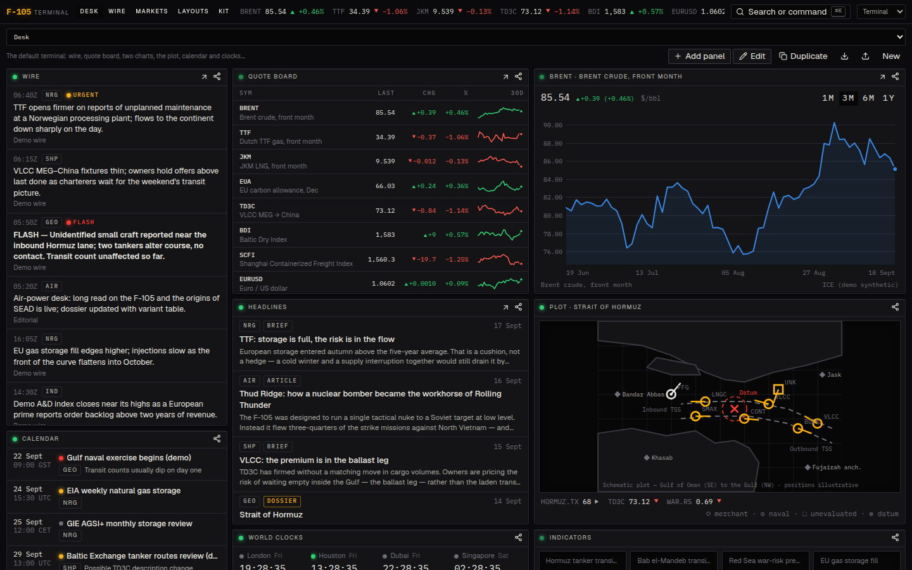
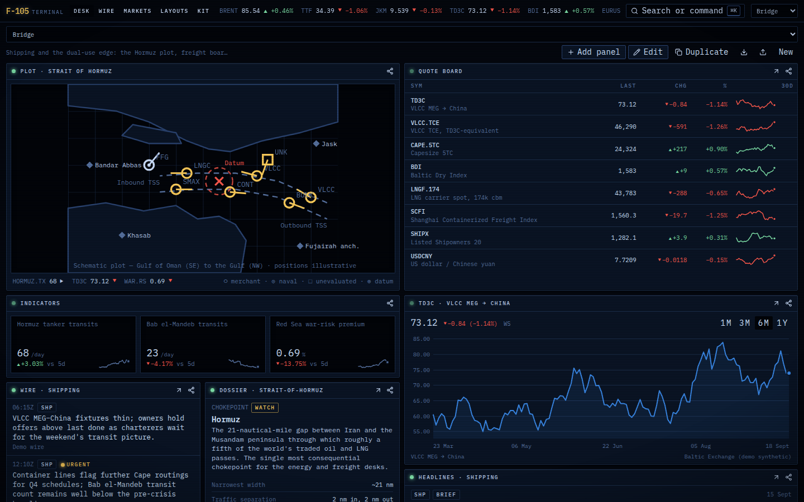
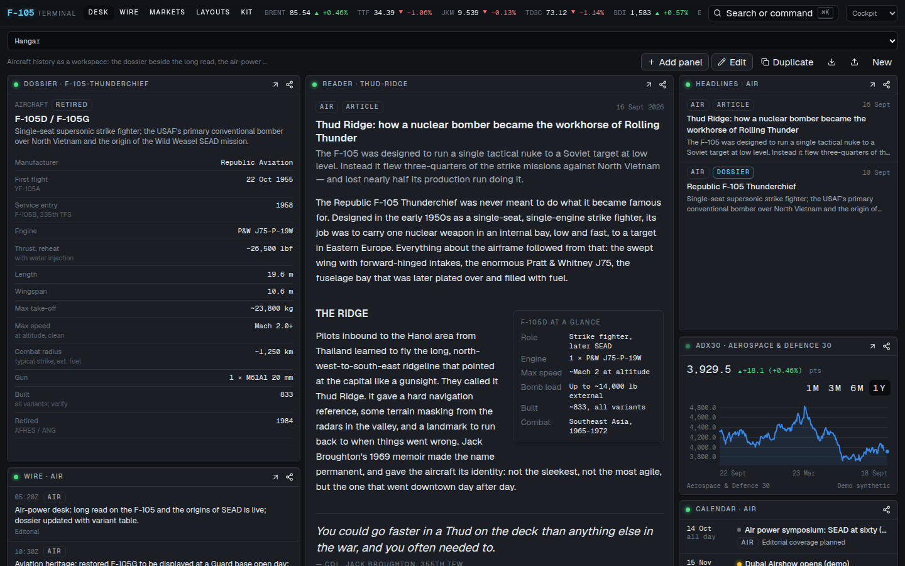
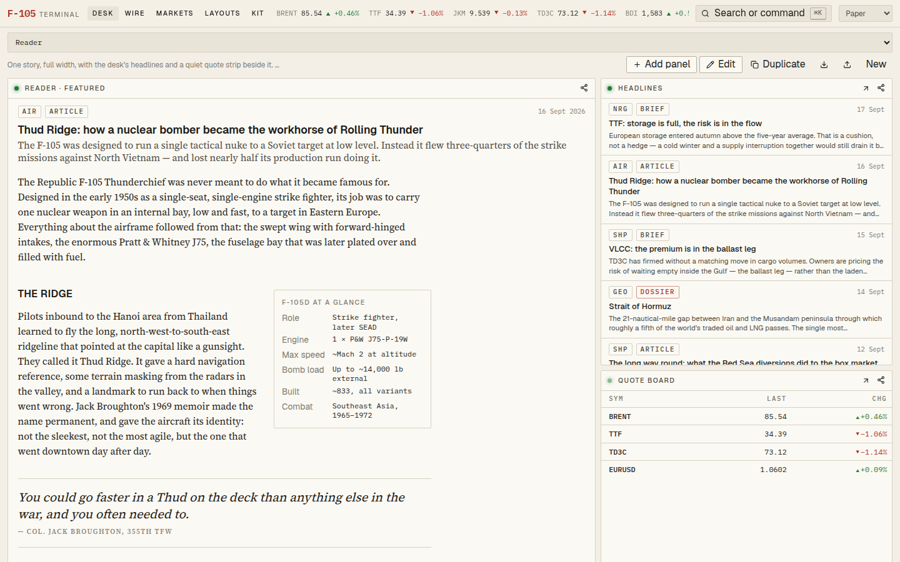
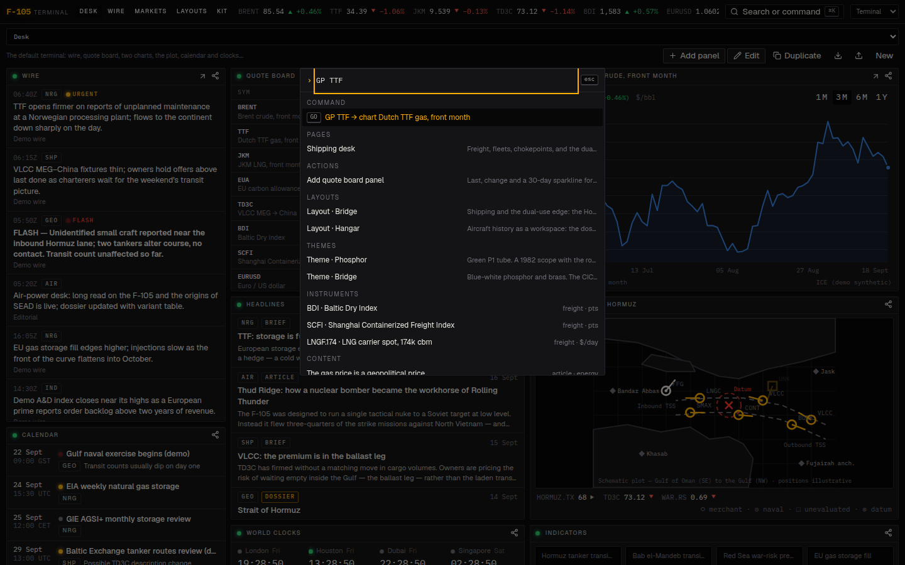

# F-105 — an intelligence terminal

Bloomberg Terminal's utility, an iPhone's attention to detail, and a second reading of
everything: the same screen holds an aircraft dossier, a gas curve and a chokepoint plot,
and every ship class carries both its civil and its military reading.

**Stack:** Next.js 16 (App Router, React 19, Turbopack) · TypeScript · Tailwind v4 ·
Zod · Zustand · MDX. Deploys to Vercel with zero configuration. Built to be extended
agentically: every extension point is a file with a schema and a documented recipe
(see `CLAUDE.md`).



| Bridge layout · Bridge theme | Hangar layout · Cockpit theme |
|---|---|
|  |  |

| Reader layout · Paper theme | Command bar |
|---|---|
|  |  |

## Run it

```sh
pnpm install
pnpm dev          # http://localhost:3000
pnpm check        # tokens → lint → typecheck → content → layouts → tests
pnpm build && pnpm start
```

Node ≥ 20.9. No environment variables are required for the demo; see `.env.example`.

## What is in the box

| Area | Where | What |
|---|---|---|
| **Workspace** | `/` | The terminal. A layout of panels on a 12-column grid. Edit mode drags, resizes, adds, removes. Under 768 px the same layout stacks. |
| **Layouts** | `layouts/*.json`, `/layouts` | Six presets (Desk, Reader, Energy desk, Hangar, Bridge, Pocket). Anything you change forks into your own layout, persisted on-device, exportable as JSON. |
| **Panels** | `src/panels/*` | Wire, Quote board, Chart, Headlines, Reader, Dossier, Plot, Calendar, World clocks, Notes, Indicators. Each is a schema + component + settings fields. |
| **Themes** | `src/design/tokens.json` | Terminal, Phosphor, Cockpit, Bridge, Paper, Glass. One JSON → generated CSS. Functional skeuomorphism: bezels, LEDs, scanlines and glow are tokens a theme can turn to zero. |
| **Command bar** | ⌘K or `/` | Search everything, or type mnemonics: `GP TTF`, `DES F-105`, `THEME PAPER`, `LAYOUT BRIDGE`, `WIRE SHP`. |
| **Content** | `content/**` | Articles, briefs (with a bottom line), dossiers (with spec sheet and dual-use notes), wire items, calendar events. MDX + JSON, Zod-validated. |
| **Data** | `src/data/*`, `/api/quotes`, `/api/series/:symbol` | Instrument registry and a provider interface. The demo provider is deterministic synthetic data; swap it for ICE, Baltic/Clarksons/SSY, viaNexus, etc. |
| **Messaging** | `src/lib/share.ts` | No in-app chat. Share sheet to WhatsApp, email, Slack (formatted copy), system share. Alert adapters are documented for server-side push. |
| **Kit** | `/kit` | Every primitive in the current theme. The Forstall page: if it is not here, it is not a component. |

## Deploy to Vercel

1. Push this repository to GitHub (done if you are reading this there).
2. In Vercel: **Add New → Project → Import** the repo. Framework is detected as Next.js; no settings needed.
3. Optionally set `NEXT_PUBLIC_SITE_URL` to the production domain so share links are absolute.

Every push to the production branch redeploys; every other branch gets a preview URL.

## Structure

```
content/           articles/ briefs/ dossiers/ (MDX) · wire/ events/ (JSON)
layouts/           preset layouts (JSON)
docs/              ARCHITECTURE · DESIGN · CONTENT · LAYOUTS · ROADMAP
scripts/           tokens-to-css · validate-content · check-layouts
src/
  app/             routes: / read/ dossier/ wire/ markets/ desk/ layouts/ kit/ api/
  components/      shell (topbar, status bar, command bar, share) · ui · charts · content
  config/site.ts   name, desks, channels — rebrand here
  content/         schema.ts (Zod) · loader.ts (server) · mdx.tsx (in-article kit)
  data/            instruments.ts · mock.ts · providers/ · format.ts · types.ts
  design/          tokens.json (source of truth) · tokens.ts · themes.css (generated)
  layout-engine/   schema · grid maths · store · WorkspaceGrid · PanelFrame · settings
  panels/          catalog.ts (server-safe) · registry.tsx (client) · one folder per panel
  lib/             hooks and helpers
```

## Status

This is the architecture and a demo. The content is placeholder (labelled as such in the
UI), the numbers are synthetic, and persistence is on-device. `docs/ROADMAP.md` lists what
comes next: real data adapters, Supabase persistence and auth, alerts to WhatsApp/Slack/email,
and the iOS build.
