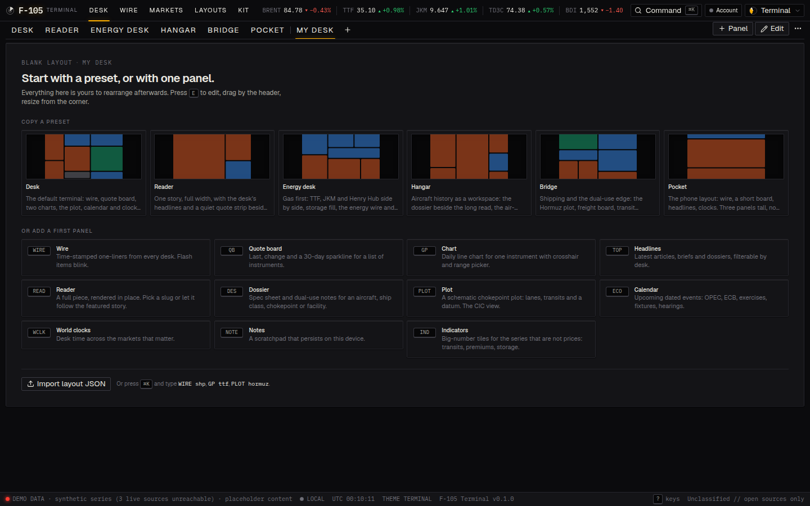
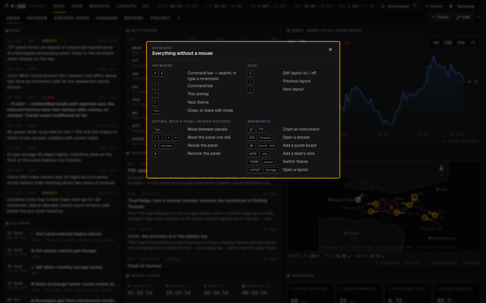

# F-105 — an intelligence terminal

Bloomberg Terminal's utility, an iPhone's attention to detail, and a second reading of
everything: the same screen holds an aircraft dossier, a gas curve and a chokepoint plot,
and every ship class carries both its civil and its military reading.

**Stack:** Next.js 16 (App Router, React 19, Turbopack) · TypeScript · Tailwind v4 ·
Zod · Zustand · MDX. Deploys to Vercel with zero configuration. Built to be extended
agentically: every extension point is a file with a schema and a documented recipe
(see `CLAUDE.md`).


| Bridge layout · Bridge theme | Hangar layout · Cockpit theme |
|---|---|
|  |  |

| Reader layout · Paper theme | Command bar |
|---|---|
|  |  |

| A blank layout starts here | Keyboard help (`?`) |
|---|---|
|  |  |

## Run it

```sh
pnpm install
pnpm dev          # http://localhost:3000
pnpm check        # tokens → lint → typecheck → content → layouts → tests
pnpm build && pnpm start
```

Node ≥ 20.9. No environment variables are required for the demo; see `.env.example` for
the optional ones: a free FRED key for live energy and FX, Supabase for sign-in and sync,
and the alert channels.

## What is in the box

| Area | Where | What |
|---|---|---|
| **Workspace** | `/` | The terminal. A layout of panels on a 12-column grid. Edit mode drags, resizes, adds, removes. Under 768 px the same layout stacks. |
| **Layouts** | `layouts/*.json`, `/layouts` | Six presets (Desk, Reader, Energy desk, Hangar, Bridge, Pocket). Anything you change forks into your own layout, persisted on-device, exportable as JSON. |
| **Panels** | `src/panels/*` | Wire, Quote board, Chart, Headlines, Reader, Dossier, Plot, Calendar, World clocks, Notes, Indicators. Each is a schema + component + settings fields. |
| **Themes** | `src/design/tokens.json` | Terminal, Phosphor, Cockpit, Bridge, Paper, Glass. One JSON → generated CSS. Functional skeuomorphism: bezels, LEDs, scanlines and glow are tokens a theme can turn to zero. |
| **Command bar** | ⌘K or `/` | Search everything, or type mnemonics: `GP TTF`, `DES F-105`, `THEME PAPER`, `LAYOUT BRIDGE`, `WIRE SHP`. |
| **Content** | `content/**` | Articles, briefs (with a bottom line), dossiers (with spec sheet and dual-use notes), wire items, calendar events. MDX + JSON, Zod-validated. |
| **Data** | `src/data/*`, `/api/quotes`, `/api/series/:symbol`, `/api/status` | Instrument registry and a composite provider: FRED (free key) and ECB rates where they cover a symbol, deterministic synthetic data for the rest, provenance shown everywhere. Licensed vendors are one adapter each. |
| **Persistence** | `src/lib/supabase`, `src/layout-engine/sync.ts`, `/account` | On-device by default. With a Supabase project: email sign-in and cross-device sync of layouts, theme, notes, watchlist. |
| **Messaging** | `src/lib/share.ts`, `src/lib/notify`, `content/alerts/rules.json` | No in-app chat. Share sheet to WhatsApp, email, Slack, system share. Server-side alerts (Slack, WhatsApp Business, email) from JSON rules on a cron. |
| **Reading** | `/read/:slug`, `/dossier/:slug` | A reading surface: progress line, S/M/L type size, one tap to the Paper theme and back, a drop cap on Paper, and a masthead that gets out of the way on phones. |
| **Kit** | `/kit` | Every primitive in the current theme. The Forstall page: if it is not here, it is not a component. |

## Keyboard

`?` shows every shortcut. The ones worth memorising: `⌘K` command bar, `E` edit the
layout, `[` and `]` to cycle layouts, `T` next theme. In edit mode, Tab to a panel header
and use the arrows to move it, shift-arrows to resize.

## Deploying

Two builds come out of this one repository.

### Vercel — the full app (recommended)

1. In Vercel: **Add New → Project → Import** this repo. Framework is detected as Next.js; no settings needed.
2. Optionally set `NEXT_PUBLIC_SITE_URL` to the production domain so share links are absolute,
   `FRED_API_KEY` for live energy series, the Supabase variables for sync, and `CRON_SECRET`
   plus channel credentials for alerts (`vercel.json` schedules the daily run).

Every push to the production branch redeploys; every other branch gets a preview URL.
This is the only target that runs the API routes, the session proxy and the alert cron.

### GitHub Pages — the static demo

**Live: https://charlie-del-hash.github.io/F-105/**

`.github/workflows/pages.yml` rebuilds and republishes on every push to the default branch.
It pushes the export to the generated `gh-pages` branch, which is what Pages serves. Never
edit that branch; it is build output.

`pnpm build:static` produces the same thing locally. It moves the server-only files aside,
exports with `output: "export"`, and puts them back, so the working tree is untouched either way.
The client falls back to the deterministic mock generator, which means the demo still ticks
once a minute. What it cannot have:

| Works | Does not |
|---|---|
| Every panel, layout, theme and page | Live sources: everything reads synthetic |
| Quotes and charts, ticking | Alerts: no cron, no channels |
| Editing layouts, saved on the device | Sign-in and cross-device sync |
| The command bar and keyboard | |

The status bar says `DEMO DATA · synthetic series` throughout, so nobody mistakes it for the real thing.

## Structure

```
content/           articles/ briefs/ dossiers/ (MDX) · wire/ events/ (JSON)
layouts/           preset layouts (JSON)
docs/              ARCHITECTURE · DESIGN · CONTENT · LAYOUTS · DATA · PERSISTENCE · ALERTS · ROADMAP
supabase/          migrations (workspaces, alert_log) and setup notes
scripts/           tokens-to-css · validate-content · check-layouts
src/
  app/             routes: / read/ dossier/ wire/ markets/ desk/ layouts/ kit/ api/
  components/      shell (topbar, status bar, command bar, share) · ui · charts · content
  config/site.ts   name, desks, channels — rebrand here
  alerts/          rules · schema · evaluate · dedupe
  content/         schema.ts (Zod) · loader.ts (server) · mdx.tsx (in-article kit)
  data/            instruments.ts · mock.ts · derive.ts · providers/ (fred, ecb, composite, mock)
  design/          tokens.json (source of truth) · tokens.ts · themes.css (generated)
  layout-engine/   schema · grid maths · store · WorkspaceGrid · PanelFrame · settings
  panels/          catalog.ts (server-safe) · registry.tsx (client) · one folder per panel
  lib/             hooks and helpers · supabase/ clients · notify/ channels
  proxy.ts         Next.js 16 proxy: refreshes the Supabase session cookie
```

## Status

This is the architecture and a demo. The content is placeholder and labelled as such in
the UI. Numbers are live where a free source covers them (ECB rates out of the box, FRED
with a key) and synthetic elsewhere, always marked. Persistence, sign-in and alerts switch
on with environment variables. `docs/ROADMAP.md` lists what comes next: licensed data
feeds, layout sharing, per-user alert rules, and the iOS build.
